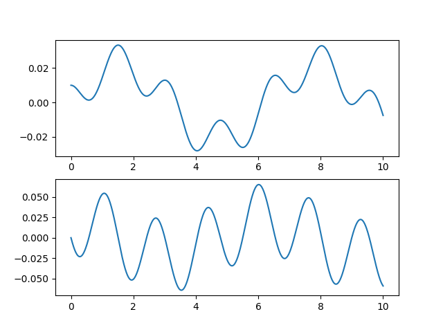

Docs are [here](https://docs.rs/lsode).

# Solve systems of differential equations

This crate uses ODEPACK Fortran library to solve systems of ordinary differential equations.

I created this crate mainly to be able to solve **stiff** ODE problems in Rust.

# Example

This example has the setup from [DifferentialEquations.jl documentation](https://docs.juliadiffeq.org/stable/tutorials/ode_example/#Example-3:-Solving-Nonhomogeneous-Equations-using-Parameterized-Functions-1).

```rust
use lsode::{linspace, solve_ode};

fn main() {
    let l: f64 = 1.0;
    let m: f64 = 1.0;
    let g: f64 = 9.81;
    let torque = |t: &f64| 0.1*t.sin();

    let f = |y: &[f64], t: &f64 | {
        let mut dy = vec![0.0, 0.0];
        dy[0] = y[1];
        dy[1] = -3.0*g/(2.0*l)*y[0].sin() + 3.0/(m*l*l)*torque(t);
        dy
    };

    let y0 = [0.01, 0.0];
    let ts = linspace(0.0, 10.0, 1000);
    let (atol, rtol) = (1e-6, 1e-6);

    let sol = solve_ode(f, &y0, ts.clone(), atol, rtol);

    for (i, t) in sol.iter().zip(ts) {
        println!("{} {} {}", t, i[0], i[1]);
    }
}
```




# ODEPACK

I obtained the [ODEPACK][1] code that is present in this repository from [here](http://www.netlib.org/odepack/).
I do not know what the licensing of the original ODEPACK code is, I assume it is released to the public domain.

[1]: https://computing.llnl.gov/casc/odepack/odepack_home.html
